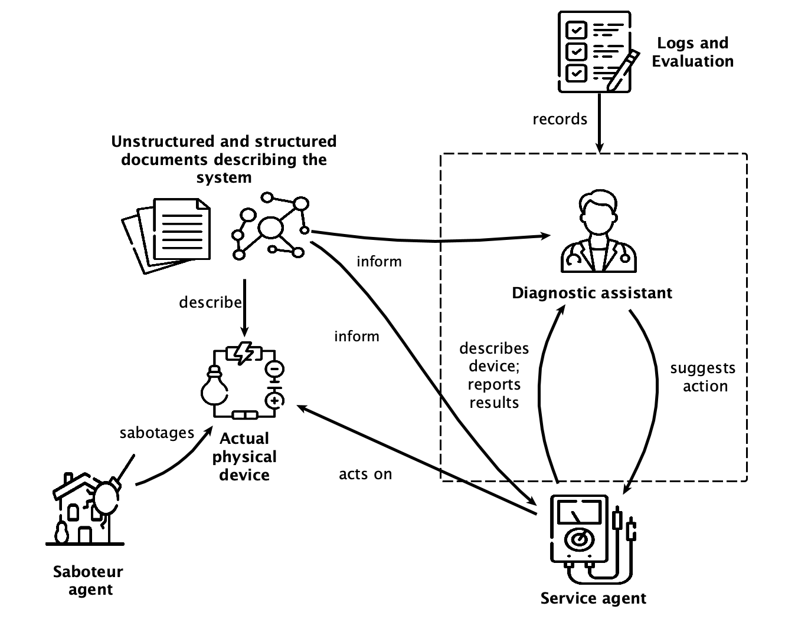
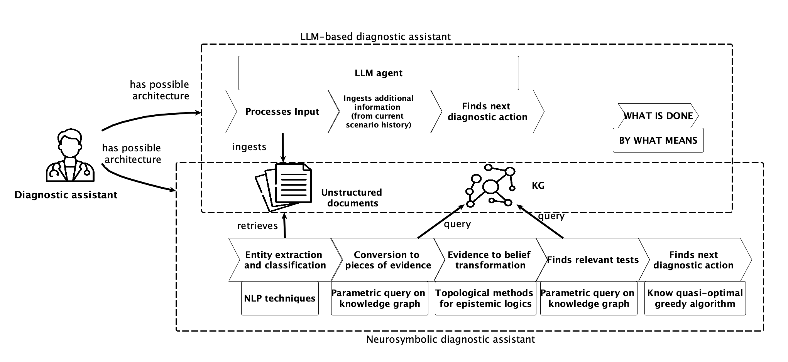

# A Prototyping Environment for Comparing Neuro-symbolic Diagnostic Assistants

## Intro 

This repo contains the codebase associated to the DEMO paper `A Prototyping Environment for Comparing Neuro-symbolic Diagnostic Assistants`. 

The codebase function is to run diagnostic scenarios. By diagnostic scenario we mean a series of activities that starts with sabotaging a physical or virtual engineered system by inducing a fault (by some agent) and ends with the individuation of such a fault (by some other agent). 

The environment where each scenario happens is depicted below: 



Thus, the core of the environment is made of the underlying engineered system and three agents: a saboteur that injects a fault in the system, a service agent which must diagnose the injected fault, and a diagnostic assistant.
The most important agent is the latter assistant, which helps the service agent through the diagnostic process: we want to run diagnostic scenarios to explore the behavior of different diagnostic assistants. 

## Structure

The codebase is organized as follows:
```
Implementations
Knowledge_sources
Utilities
static
configuration.py
environment_classes.py
run_diagnostic_scenario.py
scenarios.xlsx
voice_client.py
voice_server.py
```

The file `run_diagnostic_scenario.py` is the code entry point (see below section on usage). Its function is to instantiate a configuration object (described in `configuration.py`), to instantiate the agents for a scenario and to orchestrate such a scenario.
The file `environment_classes.py` contains an abstract description of the prototyping environment agent classes and of their interactions.

The folder `Implementations` contains a list of concrete classes that implement the abstractions of `environment_classes`. 

Knowledge sources (in the homonimous folder) are divided into structured (knowledge graphs) and non-structured (text, diagrams). They are related to three different real toy physical electrical systems and describe different aspects of them (the text describes the concrete structure and the functions of the systems, the diagrams are electrical schematics, and the knowledge graphs contain component connection and hierarchy and information about functions, problems, and relevant tests). All systems are made from a small set of modules (3 to 10) and have the main function of turning on a small light. 

In the `scenario` spreadsheet a list of possible faults to inject in the systems, to start scenarios, is reported. 

The content of the static folder, and the `voice_client` and `voice_server` files provide a vocal interface via browser (for laptop or mobile devices). 


## Assistant implementations

The core of the codebase, in addition to the abstract layout of the scenario environment, are the implementations of the diagnostic assistant. 

Currenly, two such implementations are present. One is a monolithic LLM agent, the other is a neuro-symbolic (mainly symbolic) agent. The structure of the LLM agent is straightfoward, while the one of the neuro-symbolic agent is more complicated. The picture below summarizes it, while all the details can be read in the corresponding file (`diagnosticAssistantEvidenceKGOptimal.py`).  



## Usage

The full list of arguments required for execution can be found by runnning `python run_dignostic_scenario.py --help`. 
The most important arguments are the agent types and the system description input. The agent type arguments are: `saboteur`, `service`, and `assistant`. By supplying these types, different implementations of these three agents are instantiated at runtime. Possible values are present in the arguments descriptions. 
The system description arguments are `text-input-file` and `diagram`, containing the locations of a textual description and a pictorial schematics of the underlying system, respectively. In addition, `ontology` and `kg` contain the locations of the ontology (TBox containing classes only) and the knowledge graph (ABox of the ontology containing specific instances) that are required for using the neurosymbolic assistant. 

### Voice input

To interact with voice (stt, tts), use a device as a server and host the voice_server app on some port, e.g.:
`uvicorn voice_server:app --host 0.0.0.0 --port 8000`

Then, browse to the address
`<server ip address>:<port number>/client.html`

For instance, in the case of local hosting on port 8000:
`http://127.0.0.1:8000/client.html`

### Requirements

They are listed in the file `requirements.txt`, which was generated with pipreqs.  

### Logging

The overall managing of the interactions between the agents happens through an orchestrator component (`run_diagnostic_scenario` function). The orchestrator logs some high level information about each diagnostic scenario run. Each agent implementation logs entries about its own behavior. These entries are listed in files called `DIAGNOSTIC_SCENARIO_RUN_<timespan>`, in the log folder (default value: `Logs`)

## Video

a video pitching the demo is present in the releases (https://github.com/kataph/Diagnostic-Assistant-Demo/releases/tag/v1.0)

## TODOS

- [X] upload video
- [ ] clean code
- [ ] clean CLI interface and configuration
- [ ] clean hidden files from repo
- [ ] add more scenarios
- [ ] more testing
